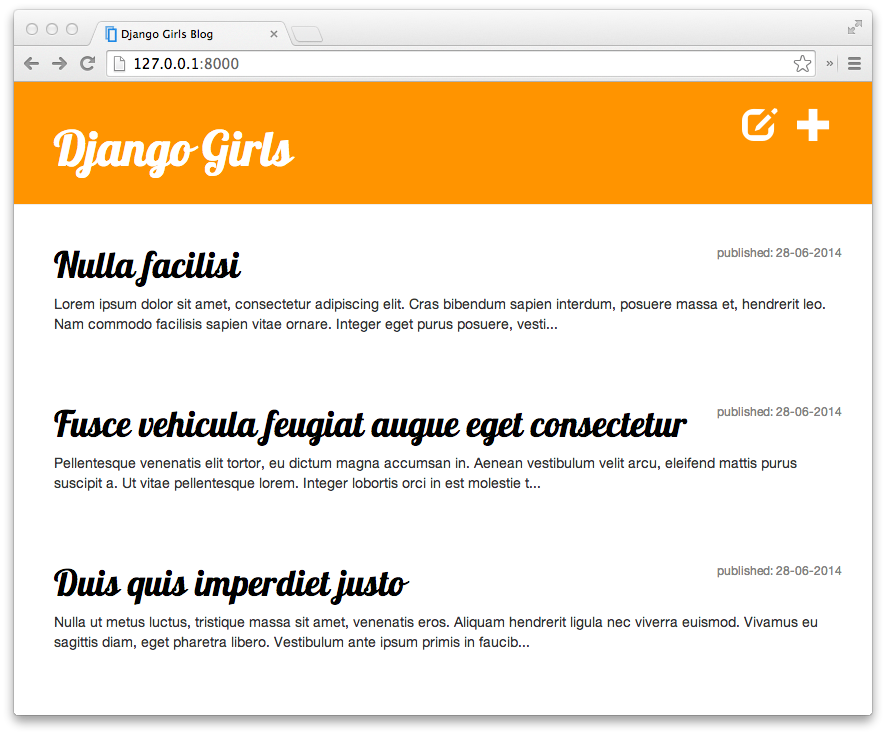

# Django Girls Tutorial

> これは、Creative Commons Attribution-ShareAlike 4.0 International License のライセンスの下で提供しています。ライセンスについてはこちらをご確認ください。
http://creativecommons.org/licenses/by-sa/4.0/

## Introduction

テクノロジーが日々進化して、次々とでてくる新しいものに驚いていませんか？ウェブサイトはどうやって動いているのだろうと興味をもちつつ、先延ばしにしていませんか？難しそうと思って、１人で勉強するのを辞めちゃったことはありませんか？

そんなあなたに朗報です！プログラミングはそれほど難しくありませんよ。楽しみかたをお教えします！！

このチュートリアルは、魔法のようにあなたをプログラマーに変身させるものではありません。上手くなりたかったら、何ヶ月あるいは何年もの勉強と練習を積まなければいけません。しかし、このチュートリアルをとおして、プログラミングやウェブサイトを作成することはあなたが思っているほど複雑ではないことを分かってもらえればと思います。できるだけ細かく説明していきますね。コワイと思わず、新しい世界に一歩を踏み出してみてください！

あなたがテクノロジーやプログラミングを楽しんでくれると嬉しいです！！

## What will you learn during the tutorial?

このチュートリアルを終える頃には、シンプルなウェブアプリケーションができているでしょう。あなたのブログです。オンラインへ載せる方法もお教えするので、お友達にも見せることができますよ！

このようなサイトが出来上がります！:

> もしあなたがこのチュートリアルを１人ですすめていて、質問をできるコーチが周りにいない時は、ここにチャットを用意しています。: . これまでにワークショップに参加したことがある方やコーチの皆さんが、このチャットで助けてくれることでしょう。心配せずに、質問をなげかけてみてくださいね！

OK, [では、早速はじめていきましょう...](./how_the_internet_works/README.md)

## About and contributing

This tutorial is maintained by [DjangoGirls](http://djangogirls.org/). If you find any mistakes or want to update the tutorial please [follow the contributing guidelines](https://github.com/DjangoGirls/tutorial/blob/master/CONTRIBUTING.md).

## Translation into Japanese

多くの有志により、チュートリアルの日本語翻訳やアップデートがおこなわれています。

