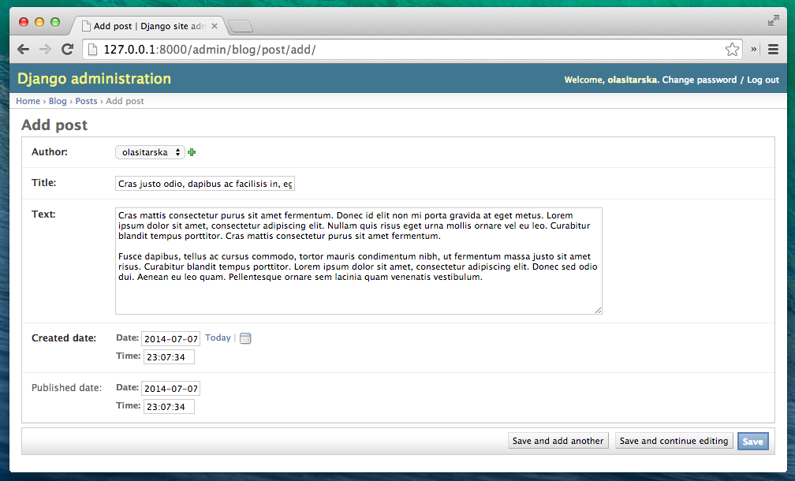

# Django admin

今作成したポストを追加、編集、削除するのにDjango adminを使います。  
まず`blog/admin.py`ファイルを開いて、コンテンツをこれに置き換えましょう。

    from django.contrib import admin
    from .models import Post

    admin.site.register(Post)

見て分かる通り、前回定義したPostモデルをimportしています。モデルをadminページで見れるようにするには、モデルを`admin.site.register(Post)`で登録する必要があります。

ではPostモデルを見てみましょう。Webサーバーを走らせるにはConsoleの中で`python manage.py runserver`を走らせ ることを覚えておいて下さい。ブラウザに行って  http://127.0.0.1:8000/admin/ とアドレスバーにタイプします。こんなログインページが出ますね。

ログインするには、superuser （サイトの全てを管理するユーザー）を作る必要があります。コマンドラインに戻って、`python manage.py createsuperuser`とタイプしenter、それからユーザー
ネーム（小文字スペース無し）、聞かれたらメールアドレスとパスワードを入れます。タイプしてる間パスワードは見えなくても大丈夫、それが正常です。タイプしてEnterを押して続けましょう。そうすればこのように見えるはずです。（ユーザーネームとパスワードは今あなたがタイプしたものです。）

    (myvenv) ~/djangogirls$ python manage.py createsuperuser
    Username: admin
    Email address: admin@admin.com
    Password:
    Password (again):
    Superuser created successfully.

ブラウザに戻ってsuperuserでログインすると、Django admin ダッシュボードが見えるでしょう。

Postsに行って少し試してみてください。5～6のブログポストを入れてみましょう。コンテンツは心配しなくて大丈夫。今はとりあえずこのチュートリアルからテキストをいくつかコピペするだけでいいです。

少なくとも2~3のポスト（全部じゃなくても）がポスト時刻を表示しているかだけ確認してください。これが後で役立ちます。

もしDjango adminについてもっと知りたければ、Django's documentationを見て下さい。
https://docs.djangoproject.com/ja/1.11/ref/contrib/admin/

さてコーヒー飲むか何かつまんでください。
初Django modelを作ったんですから休憩しましょう！
