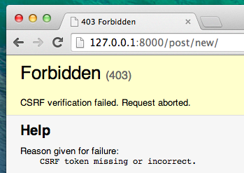
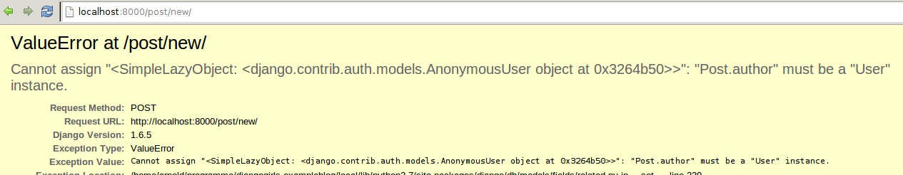

# Django フォーム

最後に、ブログ記事の追加と編集を、ウェブサイト上でできるようにしましょう。Djangoの管理画面はクールですが、カスタマイズして綺麗に作るのはとても難しいです。`フォーム` はインターフェースを介してパワフルな機能を提供し、私たちが想像できるほとんどの操作を行うことができます。

Djangoのフォームの良いところは、ゼロからスクラッチもできるし、モデルにフォームの結果を保存するための `ModelForm` を作成することもできます。

それを利用して、これから `Post` モデル用のフォームを作成しましょう。

Djangoの重要な他のパーツと同じように、フォームのためのファイル `forms.py` を作成します。

`forms.py` というファイルを `blog` ディレクトリの配下に作成します。

    blog
       └── forms.py

いいですね、では `blog/forms.py` を開いて次のコードを入力します：

    from django import forms

    from .models import Post

    class PostForm(forms.ModelForm):

        class Meta:
            model = Post
            fields = ('title', 'text',)

まずDjangoのフォームモジュールをインポートします(`from django import forms`)。そして私たちが定義したmodels.pyから `Post` モデルをインポートします(`from .models import Post`)。

予想しているでしょうが、このフォームの名前は `PostForm` にします。そしてこのフォームを `ModelForm` として使用できるように `forms.ModelForm` を継承します（Djangoの機能をうまく使うためのおまじないと思ってください) 。

次に、 インナークラスとして `class Meta` を定義し、どのモデルからこのフォームを作成するべきかを指定します(`model = Post`)。

最後に、どのフィールドをこのフォームで使用するかを指定します。ここでは `title` と `text` のみ指定します。`author` は現在ログインしている人（あなたのことです）、`created_date` は投稿日が自動で入るようにしましょう。

ひとまずこっちはこれでおしまいです！次は *view* とテンプレートでフォームを表示するようにします。

そのためもう一度、ページへのリンクとURLとビューとテンプレートを作成します。

## フォームを含むページへのリンク

`blog/templates/blog/base.html` を開き、 `div class="page-header"` タグ内にリンクを追加します:

    <a href="" class="top-menu"></a>

新しいビュー `post_new` を呼び出していることに注意してください。

先ほどのリンクを追加した後のテンプレートファイルは次のようになります:

    
    <html>
        <head>
            <title>Django Girls blog</title>
            <link rel="stylesheet" href="//maxcdn.bootstrapcdn.com/bootstrap/3.2.0/css/bootstrap.min.css">
            <link rel="stylesheet" href="//maxcdn.bootstrapcdn.com/bootstrap/3.2.0/css/bootstrap-theme.min.css">
            <link href='//fonts.googleapis.com/css?family=Lobster&subset=latin,latin-ext' rel='stylesheet' type='text/css'>
            <link rel="stylesheet" href="">
        </head>
        <body>
            

                <a href="" class="top-menu"></a>
                <h1><a href="/">Django Girls Blog</a></h1>
            

            

                

                    

                        
                        
                    

                

            

        </body>
    </html>

これを保存して `http://127.0.0.1:8000` を更新してください。するとお馴染みの `NoReverseMatch` エラーが発生するはずです。発生しましたか?

## URL

それではURLを追加します。 `blog/urls.py` を開き次の行を追加します。

    url(r'^post/new/$', views.post_new, name='post_new'),

追加した後の `blog/urls.py` は次のようになります。

    from django.conf.urls import include, url
    from . import views

    urlpatterns = [
        url(r'^$', views.post_list),
        url(r'^post/(?P<pk>[0-9]+)/$', views.post_detail),
        url(r'^post/new/$', views.post_new, name='post_new'),
    ]

サイトを更新すると `AttributeError` が発生します。これは `post_view` を実装していないためです。それでは `post_view` を追加しましょう。

## post_new ビュー

`post_view` を実装していきます。 `blog/views.py` に次の行を追加します。まずは `from` の行から:

    from .forms import PostForm

*view* はこのようになります:

    def post_new(request):
        form = PostForm()
        return render(request, 'blog/post_edit.html', {'form': form})

新しい `Post` フォームを作成するために、 `PostForm()` でPostFormをインスタンス化してテンプレートに渡します。また後でここの *view* の実装を変更しますが、そのまえにテンプレートを作りましょう。

## テンプレート

`blog/templates/blog` ディレクトリ配下に `post_edit.html` を作成します。フォームを動作させるためにはいくつかやることがあります。

- フォームを表示する必要があります。簡単な例としては `{{ form.as_p }}` と記述することです。
- 上記の行はformtタグでラップする必要があります: `<form method="POST">...</form>`
- `Save` ボタンが必要です。HTMLではボタンは次のように書きます: `<button type="submit">Save</button>`
- 最後にformタグ内(開formタグ直後)に `` を追加します。これによりこのフォームがセキュアになるので、とても大切です。もしこれを記述せずにフォームを保存しようとするとDjangoは文句を言います。

それでは `post_edit.html` 内のHTMLがどのように見えるべきかを見てみましょう:

    

    
        <h1>New post</h1>
        <form method="POST" class="post-form">
            {{ form.as_p }}
            <button type="submit" class="save btn btn-default">Save</button>
        </form>
    

更新します。わーい! フォームが表示されました!

しかし、ちょっと待ってください! `title` と `text` フィールドを入力して保存しようとすると何が起こるのでしょうか？

何も起こりません! 同じページが再度表示され、私たちのテキストがなくなって...そして新しい投稿が追加されていません。何が間違っているのでしょうか？

その答えは...。間違えてはいませんが *view* に対してもう少し作業を行う必要があります。

## formをsaveする

`blog/views.py` を再度開きます。すでに `post_new` ビューがあります:

    def post_new(request):
        form = PostForm()
        return render(request, 'blog/post_edit.html', {'form': form})

フォームをsubmitするとき、今は同じビューに戻りますが、このとき `request` 内(より具体的には `request.POST` 内)にフォームのデータが保持されています。HTMLファイルで定義された `<form>` タグに `method="POST"` が指定されていたことを覚えていますか?フォームのすべてのフィールドが `request.POST` 内にあります。`POST` の名前を他の名前に変更することはできません (それを変更する唯一の方法は `method` に `GET` を指定することですが、それがなぜ間違いであるかを話す時間がありません)

そのため *view* では2つの状況をハンドルするようにします。1つ目は初回アクセス時で空のフォームが欲しい時です。2つ目はフォームの入力を終えて全てのフォームのデータともに *view* に戻る時です。そこで条件を追加します(そのために `if` を使用します)。

    if request.method == "POST":
        [...]
    else:
        form = PostForm()

それでは `[...]` の部分を埋めていきます。 `method` が `POST` の場合、フォームから送られたデータを用いて `PostForm` を作成するために次のようにします:

    form = PostForm(request.POST)

簡単ですね! 次にフォームの値が正しいかどうかをチェックします（すべての必須フィールドが設定され、全く誤った値が保存されていないことを）。 `form.is_valid()` を使うことでチェックできます。

フォームをチェックして、フォームの値が有効であれば保存できます。

    if form.is_valid():
        post = form.save(commit=False)
        post.author = request.user
        post.save()

基本的にここでは2つのことを行います。まず `form.save` でフォームを保存することと `author` を追加することです(まだ `PostForm` 内に `author` フィールドがありませんし、このフィールドは必須です)。`commit=False` は `Post` モデルをまだセーブしません。ではauthorを追加します。`commit=False` を指定せず `form.save()` を実行します。そしてこのケースではそれが必要です。
`post.save()` は変更(authorの追加) を保存し、新しいブログ記事を作成します。

最後に、新しく作成された記事の `post_detail` ページを表示できれば良いですよね? そのために次のインポートを追加します:

    from django.shortcuts import redirect

それをファイルの先頭に追加します。これでようやく、新しく作成されたポストのための `post_detail` ページに移動する処理を書けます。

    return redirect('blog.views.post_detail', pk=post.pk)

`blog.views.post_detail` は新しく作成されたポストのために `post_detail` ページに移動するためのビューです。 この *view* では `pk` 変数が必須であることを覚えていますか? `post` では新しいブログ記事が作成されます。

OK, たくさんのことを説明しました。全体の *view* は以下のようになります。

    def post_new(request):
        if request.method == "POST":
            form = PostForm(request.POST)
            if form.is_valid():
                post = form.save(commit=False)
                post.author = request.user
                post.save()
                return redirect('blog.views.post_detail', pk=post.pk)
        else:
            form = PostForm()
        return render(request, 'blog/post_edit.html', {'form': form})

では動作確認してみます。http://127.0.0.1:8000/post/new/ に行き、 `title` と `text` を追加し、保存します...。できあがり! 新しいブログ記事が追加され、`post_detail` にリダイレクトされます！

おそらくあなたは日付が設定されていないことに気づいたことでしょう。 それについては __Django Girls Tutorial: Extensions__ 内の _publish button_ をみてください。

素晴らしい！

## フォームのバリデーション(検証)

ここではDjangoのフォームのクールなところを紹介します。ブログのポストは `title` と `text` のフィールドが必要です。`Post` モデルでは、これらのフィールドがなくてもよいとは書いておらず(デフォルトの値が設定されている `published_date` とは対照的に)、Djangoではその場合、それらのフィールドには何らかの値が設定されないとエラーが起こるようになっています。

`title` と `text` を入力せずに保存してみましょう。何が起こるでしょうか?

Djangoはフォームのすべてのフィールドが正しいことを検証してくれます。気が利くでしょう?

> ここでは現在、Djangoの管理画面と同様に、ログイン状態で操作しています。いくつかの状況ではログアウト状態になることがあります(ブラウザを閉じる、DBを再起動するなど..)。ポストの作成時にログインユーザがわからないことでエラーが発生した場合、管理画面に移動し再度ログインすることで、その問題は一時的に解決します。メインチュートリアルの後 __Homework: add security to your website!__ の章に恒久的な対策がありますので宿題として取り組んでみてください。

## フォームの編集

今、私たちは新しいフォームを追加する方法を知っています。しかし既存のデータを編集するためはどうすれば良いのでしょうか?それは先ほど行ったことと非常に似ています。すぐにいくつかの重要なものを作成してみましょう。（もしわからない場合、コーチに尋ねるか、もしくはすでに手順をカバーしているので、前の章を見てください）

`blog/templates/blog/post_detail.html` を開いて次の行を追加します:

    <a class="btn btn-default" href=""></a>

テンプレートは次のようになります:

    

    
        

        
            {{ post.published_date }}
        
        <a class="btn btn-default" href=""></a>
        

        <h1>{{ post.title }}</h1>
        
{{ post.text|linebreaks }}

    

`blog/urls.py` には次の行を追加します:

    url(r'^post/(?P<pk>[0-9]+)/edit/$', views.post_edit, name='post_edit'),

テンプレート `blog/templates/blog/post_edit.html` を再利用します。そしてviewを追加します。

`blog/views.py` を開いて次をファイルの最後に追加します:

    def post_edit(request, pk):
        post = get_object_or_404(Post, pk=pk)
        if request.method == "POST":
            form = PostForm(request.POST, instance=post)
            if form.is_valid():
                post = form.save(commit=False)
                post.author = request.user
                post.save()
                return redirect('blog.views.post_detail', pk=post.pk)
        else:
            form = PostForm(instance=post)
        return render(request, 'blog/post_edit.html', {'form': form})

`post_view` とほとんど同じに見えますか? しかし完全に同じではありません。まずURLから `pk` パラメータを渡します。次に `Post` モデルを `get_object_or_404(Post, pk=pk)` で取得します。その後フォームを保存する際、この記事をインスタンスとしてフォームを作成します。

    form = PostForm(request.POST, instance=post)

そしてこの記事でフォームを開き編集します。

    form = PostForm(instance=post)

OK, 動作確認しましょう。 `post_detail` ページにいきます。そこの右上に [編集] ボタンがあるはずです:

クリックするとブログの記事にフォームが表示されます:

あとはお気軽にタイトルやテキストを変更して保存してください。

おめでとう！アプリケーションが完成しました。

Djangoのフォームについての詳細を知りたい場合、Django Projectのドキュメントを読んでください: https://docs.djangoproject.com/en/1.8/topics/forms/

## もう一つ: deployの時間です!

ではHeroku上で動作するかを確認しましょう。再度デプロイします。なおデプロイ方法を忘れてしまった場合は章の最後  [Deploy](../deploy/README.md) をチェックしてください:

    $ git status
    ...
    $ git add -A .
    $ git status
    ...
    $ git commit -m "Added views to create/edit blog post inside the site."
    ...
    $ git push heroku master

そしてdeployします! おめでとうございます :)
