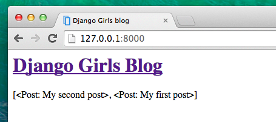

# Django templates
Djangoのテンプレート

Time to display some data! Django gives us some helpful, built-in __template tags__ for that.
何かデータを表示しましょう！Djangoはそれをビルトインのテンプレートタグで実現できます。

## What are template tags?
テンプレートタグとは？

You see, in HTML, you can't really put Python code, because browsers don't understand it. They only know HTML. We know that HTML is rather static, while Python is much more dynamic.

HTMLではブラウザがpythonを認識できないのでpythonのコードは書けません。
HTMLはより静的でpythonは動的です。

__Django template tags__ allow us to transfer Python-like things into HTML, so you can build dynamic websites faster and easier. Yikes!

DjangoのテンプレートタグはpyhtonのようなものをHTMLへ渡してくれます。動的なウェブサイトがより早く簡単に作れます!

## Display post list template
post list テンプレートの表示

In the previous chapter we gave our template a list of posts in the `posts` variable. Now we will display it in HTML.

前の章で、posts変数でテンプレートに記事のリストを渡しました。今からHTMLで表示をしてみましょう。

To print a variable in Django template, we use double curly brackets with the variable's name inside, like this:
Djangoテンプレートで変数を表示する為に、変数の名前を二重括弧で括ります。このように：

    {{ posts }}

Try this in your `blog/templates/blog/post_list.html` template (replace the second and third pair of `

` tags with `{{ posts }}` line), save the file and refresh the page to see the results:

これをblog/templates/blog/post_list.htmlに書いてみて下さい。（２つめと３つ目の

タグを{{posts}}に置き換えて下さい。）ファイルを保存してページをリロードしますと：

As you can see, all we've got is this:
見たとおり、このようになります。

    [<Post: My second post>, <Post: My first post>]

This means that Django understands it as a list of objects. Remember from __Introduction to Python__ how we can display lists? Yes, with the for loops! In a Django template, you do them this way:
これはDjangoはそれをリストのobjectだと認識します。pythonの入門章を思い出して下さい、どのようにリストを表示しましたか？ループを使ってです。Djangoではそれをこうやるとできます：

    
        {{ post }}
    

Try this in your template.
これをブログのテンプレートで使ってみましょう。

It works! But we want them to be displayed like the static posts we created earlier in the __Introduction to HTML__ chapter. You can mix HTML and template tags. Our `body` will look like this:
動きましたね。しかし、それらをHTMLの序章で作った静的な記事のような表示です。HTMLとpythonのテンプレートタグを混ぜてみましょう。bodyタグはこのようになります：

    

        <h1><a href="/">Django Girls Blog</a></h1>
    

    
        

            
published: {{ post.published_date }}

            <h1><a href="">{{ post.title }}</a></h1>
            
{{ post.text|linebreaks }}

        

    

Everything you put between `` and `` will be repeated for each object in the list. Refresh your page:
との間にpostしたい内容を置けば、リストにそれぞれのオブジェクトが続けて書かれます。ページをリロードしてみましょう。

Have you noticed that we used a slightly different notation this time `{{ post.title }}` or `{{ post.text }}`? We are accessing data in each of the fields defined in our `Post` model. Also the `|linebreaks` is piping the posts' text through a filter to convert line-breaks into paragraphs.
今回、{{post.title}}か{{post.text}}の表記が少し異なって使っていることに気づきましたか？postモデルではそれぞれのフィールドにデータがアクセスします。また|line-breaksはline-breaksを段落に変換し、postしたテキストをパイプします。

## One more thing
もう一つ...

It'd be good to see if your website will still be working on the public Internet, right? Let's try deploying to PythonAnywhere again. Here's a recap of the steps...

商用インターネットでウェブサイトを運用しているなら、いいことがあるでしょう。PythonAnywhereでデプロイできます。おさらいしましょう。

$ git status
[...]
$ git add -A .
$ git status
[...]
$ git commit -m "Added views to create/edit blog post inside the site."
[...]
$ git push

Then, log back in to PythonAnywhere and go to your Bash console (or start a new one), and run:

そしたら、Pythonanywhereに戻って、Bashコンソール（か、新しいコンソール）に入って、動かしましょう：

$ cd my-first-blog
$ git pull
[...]

Finally, hop on over to the Web tab and hit Reload on your web app. Your update should be live!
最後にブラウザのタブを開いてアプリをリロードします。更新が反映されています！

Congrats! Now go ahead and try adding a new post in your Django admin (remember to add published_date!), then refresh your page to see if the post appears there.
おめでとう！次へ進んで、Django adminとして新しい投稿を追加しましょう。（published_dateを忘れないで！）それから、投稿したものがそこに見えるか、リロードしましょう。

Works like a charm? We're proud! Step away from your computer for a bit, you have earned a break. :)

動くのが魅力に見えてきましたか？誇らしい！少しパソコンから離れて、休憩しましょう：）

