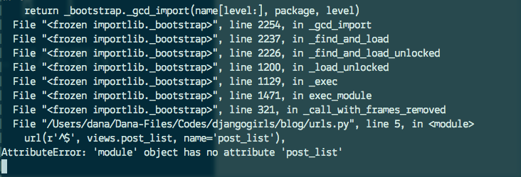

# Django urls

We're about to build our first webpage -- a homepage for your blog! But first, let's learn a little bit about Django urls.
最初のウェブページを立てましょう、あなたのブログです。始めに、djangoのURLについて少し学びましょう。

## What is a URL?

A URL is simply a web address, you can see a URL every time you visit any website - it is visible in your browser's address bar (yes! `127.0.0.1:8000` is a URL! And http://djangogirls.com is also a URL):

URLはシンプルなWEB上のアドレスです。どのサイトでもURLを見れます、ブラウザのアドレスバーで見ることができます。（そう、127.0.0.1:8000がURLです。）

Every page on the Internet needs its own URL. This way your application knows what it should show to a user who opens a URL. In Django we use something called `URLconf` (URL configuration), which is a set of patterns that Django will try to match with the received URL to find the correct view.

インターネットの全てのページはURLを持っています。これはアプリケーションがURLを開いている人を表すのがわかります。djangoでは`URL_conf`（URL設定）と呼ばれるものを使います。これは正しいviewを見つけてURLを返します。

## How do URLs work in Django?

Let's open up the `mysite/urls.py` file and see what it looks like:
`mysite/urls.py`を開いて、中身をみてみると：

    from django.conf.urls import include, url
    from django.contrib import admin

    urlpatterns = [
        # Examples:
        # url(r'^$', 'mysite.views.home', name='home'),
        # url(r'^blog/', include('blog.urls')),

        url(r'^admin/', include(admin.site.urls)),
    ]

As you can see, Django already put something here for us.
見たとおり、Djangoは既にこのようなものを置いてくれています。

Lines that start with `#` are comments - it means that those lines won't be run by Python. Pretty handy, right?

`#`で始まっている行はコメント行です。これはPythonによって実行されない行です。とっても便利でしょう？

The admin URL, which you visited in previous chapter is already here:
adminのURLは以前の章に既にありました：

    url(r'^admin/', include(admin.site.urls)),

It means that for every URL that starts with `admin/` Django will find a corresponding *view*. In this case we're including a lot of admin URLs so it isn't all packed into this small file -- it's more readable and cleaner.

`admin/`で始まる全部のURLはそうです。Djangoは一致したビューを見つけます。この場合は多くのadminのURLが含まれていて、少ないファイルに全て入っていません。読みやすくてきれいです。

## Regex

Do you wonder how Django matches URLs to views? Well, this part is tricky. Django uses `regex` -- regular expressions. Regex has a lot (a lot!) of rules that form a search pattern. It is not so easy to understand so we won't worry about it today and you'll definitely get to know them in the future. Today we will only use the ones we need.

どのやってDjangoはビューにURLをマッチするのかと思うかもしれません。そうです、この部分はひとひねりしています。Djangoは`regex`、正規表現を使います。Regexは多くの（本当に多くの）検索パターンのルールを持っています。理解するのは簡単では無いですが、今は心配しないで下さい。将来、それらを正確に理解できるでしょう。今回は必要なものだけ使っています。

Here is a simple example just to not leave you stuck on this sentence:
imagine you have a website with the address like that: `http://www.mysite.com/post/12345/`, where `12345` is the number of your post. Writing separate views for all the post numbers would be really annoying. Django makes it easier by allowing you to write `http://www.mysite.com/post/<a number>/`. Django will take care of the rest!

ここで簡単な例を次のセンテンスに集中して下さい。このようなアドレスをウェブサイトで持ったことを想像して下さい：`http://www.mysite.com/post/12345/`
12345はあなたが投稿した番号です。全ての投稿した番号を分けて書くことは頭を悩まします。Djangoはそれを`http://www.mysite.com/post/<a number>/`という書き方で簡単に作ります。後はお任せです！

## Your first Django url!

Time to create our first URL! We want 'http://127.0.0.1:8000/' to be a homepage of our blog and display a list of posts.

さあ最初のURLを作る時です！'http://127.0.0.1:8000/'はブログのページであり、ポート番号を表示しています。

We also want to keep the `mysite/urls.py` file clean, so we will import urls from our `blog` application to the main `mysite/urls.py` file.

`mysite/urls.py` ファイルをきれいにして下さい。それで`mysite/urls.py`ファイルを`blog`にインポートしましょう。

Go ahead, delete the commented lines (lines starting with `#`) and add a line that will import `blog.urls` into the main url (`''`).

コメントされた行（`#`で始まる行）を消して、main urlの箇所に`blog.urls`を足して下さい。

Your `mysite/urls.py` file should now look like this:
`mysite/urls.py`ファイルはこのようになります：

    from django.conf.urls import include, url
    from django.contrib import admin

    urlpatterns = [
        url(r'^admin/', include(admin.site.urls)),
        url(r'', include('blog.urls')),
    ]

Django will now redirect everything that comes into 'http://127.0.0.1:8000/' to `blog.urls` and look for further instructions there.

Djangoは'http://127.0.0.1:8000/'で来たものは`blog.urls`へリダイレクトし、それらに導きます。

## blog.urls

Create a new `blog/urls.py` empty file. All right! Add these two first lines:
新しく`blogs/urls.py`という空のファイルを作って下さい。これらの２行をを最小の行に追加して下さい：

    from django.conf.urls import include, url
    from . import views

Here we're just importing Django's methods and all of our `views` from `blog` application (we don't have any yet, but we will get to that in a minute!)

これはDjangoのメソッドと全ての`blog`アプリ（まだ無いが、もう少しで手に入れる）のビューをインポートします。

After that, we can add our first URL pattern:
その後、最初のURLパターンを追加します。

    urlpatterns = [
        url(r'^$', views.post_list),
    ]

As you can see, we're now assigning a `view` called `post_list` to `^$` URL. But what does `^$` mean? It's a regex magic :) Let's break it down:
- `^` in regex means "the beginning"; from this sign we can start looking for our pattern
- `$` matches only "the end" of the string, which means that we will finish looking for our pattern here

見たとおり、今アサインしたビューは`post_list`を`^$` URLにして呼び出します。`^$` とは何を意味しているのでしょうか。それは正規表現のマジックです:）分解してみましょう：
正規表現での`^`は始めを意味します。これはパターンマッチを見つけ始める記号です。
`$`はstringの最後を意味していて、それはパターンマッチを終えることを意味します。

If you put these two signs together, it looks like we're looking for an empty string! And that's correct, because in Django url resolvers, 'http://127.0.0.1:8000/' is not a part of URL. This pattern will show Django that `views.post_list` is the right place to go if someone enters your website at the 'http://127.0.0.1:8000/' address.

この２つの記号を置けば、空のstringを探します。そしてそれは正しい、DjangoのURLの名前解決で'http://127.0.0.1:8000/'はURLの一部でない。このpatternは誰かがあなたのウェブサイトに'http://127.0.0.1:8000'のアドレスで来たなら `views.post_list`が正しい場所だと示す。

Everything all right? Open http://127.0.0.1:8000/ in your browser to see the result.
いいですか？http://127.0.0.1:8000/を開いて結果を見てみましょう。

There is no "It works" anymore, huh? Don't worry, it's just an error page, nothing to be scared of! They're actually pretty useful:

「上手く動いた」とはなっていません。心配しないで下さい、これはただのエラーページです。怖がらないで下さい。これは本当に便利です：

You can read that there is __no attribute 'post_list'__. Is *post_list* reminding you of anything? This is how we called our view! This means that everything is in place, we just didn't create our *view* yet. No worries, we will get there.

アトリビュート'post_list'が無いとわかります。'post_list'は何か思い出しませんか？これはビューをどのように呼び出すかです！これはビューをまだ作っていないことを意味します。心配しないで下さい、そこまで行きましょう。

> If you want to know more about Django URLconfs, look at the official documentation: https://docs.djangoproject.com/en/1.8/topics/http/urls/

Django URLconfについて知りたい場合は、公式のドキュメントを見て下さい。
https://docs.djangoproject.com/en/1.8/topics/http/urls/
