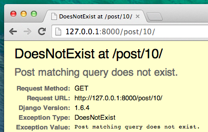

 # Extend your application

We've already completed all the different steps necessary for the creation of our website: we know how to write a model, url, view and template. We also know how to make our website pretty.

もう、ウェブサイトを作るのに必要な全ての章は終わりました。どのようにモデル、URL、ビュー、テンプレートを書いたら良いかわかっていますし、またウェブサイトの作り方もわかります。

Time to practice!
さあ練習しましょう！

The first thing we need in our blog is, obviously, a page to display one post, right?

ブログに最初に必要なものはおそらく、記事を表示するページですよね。

We already have a `Post` model, so we don't need to add anything to `models.py`.

もうPOSTモデルが入っていますから、models.pyは追加する必要はありません。

## Create a link in the template

We will start with adding a link inside `blog/templates/blog/post_list.html` file. So far it should look like:

blog/templates/blog/post_list.htmlファイルにリンクを追加しましょう。
次のように：

    

    
        
            

                

                    {{ post.published_date }}
                

                <h1><a href="">{{ post.title }}</a></h1>
                
{{ post.text|linebreaks }}

            

        
    

We want to have a link to a post detail page on the post's title. Let's change `<h1><a href="">{{ post.title }}</a></h1>` into a link:

投稿のタイトルから詳細記事へリンクさせたい時は、
`<h1><a href="">{{ post.title }}</a></h1>`の箇所をリンク先に変えてみましょう。

    <h1><a href="">{{ post.title }}</a></h1>

Time to explain the mysterious ``. As you might suspect, the `` notation means that we are using Django template tags. This time we will use one that will create a URL for us!

``という不思議なものについて説明しましょう。うすうすわかっているかもしれませんが、``という表記はDjangoのテンプレートを使っているということを意味します。これはURLを作る時に使います。

`blog.views.post_detail` is a path to a `post_detail` *view* we want to create. Please note: `blog` is the name of our application (the directory `blog`), `views` is from the name of the `views.py` file and the last bit - `post_detail` - is the name of the *view*.

`blog.views.post_detail`は`post_detail`ビューへのパスです。注：blogはアプリケーションの名前です。ビューはviews.pyファイルの名前でpost_detailはビューの名前です。

Now when we go to: http://127.0.0.1:8000/ we will have an error (as expected, since we don't have a URL or a *view* for `post_detail`). It will look like this:

 http://127.0.0.1:8000/にアクセスすると、エラーとなります。（想定通り、URLや`post_detail`のビューを持たないからです）このようになります：

Let's create a URL in `urls.py` for our `post_detail` *view*!
なので、`post_detail`ビューに`urls.py`を作りましょう。

### URL: http://127.0.0.1:8000/post/1/

We want to create a URL to point Django to a *view* called `post_detail`, that will show an entire blog post. Add the line `url(r'^post/(?P<pk>[0-9]+)/$', views.post_detail),` to the `blog/urls.py` file. It should look like this:

Djangoに`post_detail`を呼ぶビューを作りましょう。それは全てのブログの投稿を表示します。 `blog/urls.py` ファイルに`url(r'^post/(?P<pk>[0-9]+)/$', views.post_detail),`を追加して下さい。このように：

    from django.conf.urls import include, url
    from . import views

    urlpatterns = [
        url(r'^$', views.post_list),
        url(r'^post/(?P<pk>[0-9]+)/$', views.post_detail),
    ]

That one looks scary, but no worries - we will explain it for you:
何だか変に見えますが、心配しないで下さい、説明しますと、

- it starts with `^` again -- "the beginning"
`^`で始まるのは「文字列の開始」です。

- `post/` only means that after the beginning, the URL should contain the word __post__ and __/__. So far so good.
post/は文字列の開始の後に、URLにpostと/を含む

- `(?P<pk>[0-9]+)` - this part is trickier. It means that Django will take everything that you place here and transfer it to a view as a variable called `pk`. `[0-9]` also tells us that it can only be a number, not a letter (so everything between 0 and 9). `+` means that there needs to be one or more digits there. So something like `http://127.0.0.1:8000/post//` is not valid, but `http://127.0.0.1:8000/post/1234567890/` is perfectly ok!
`(?P<pk>[0-9]+)`　これはトリッキーな部分です。Djangoはここに書いた全てを受けてそれを`pk`という変数としてビューへ渡します。[0-9]は数字を伝える、文字ではなく（0から9の間)
+は１つかそれ以上の数字がそこにあることを意味しています。http://127.0.0.1:8000/post//は間違っていませんが、正しくはhttp://127.0.0.1:8000/post/1234567890/となります。

- `/` - then we need __/__ again
`/`もう一度`/`が必要です。

- `$` - "the end"!
`$`は「文字列の終了」を意味します。

That means if you enter `http://127.0.0.1:8000/post/5/` into your browser, Django will understand that you are looking for a *view* called `post_detail` and transfer the information that `pk` equals `5` to that *view*.

ブラウザで`http://127.0.0.1:8000/post/5/`を表示した時、Djangoはビューがpost_detailを呼び出すということを理解します。そして、pkの部分は5とビューへ渡します。

`pk` is shortcut for `primary key`. This name is often used in Django projects. But you can name your variable as you like (remember: lowercase and `_` instead of whitespaces!). For example instead of `(?P<pk>[0-9]+)` we could have variable `post_id`, so this bit would look like: `(?P<post_id>[0-9]+)`.

`pk`とはprimary keyの省略です。

Ok! Let's refresh the page: http://127.0.0.1:8000/ Boom! Yet another error! As expected!

OK,ページhttp://127.0.0.1:8000をリロードしてみましょう。けどまた違うエラーが出てきました！

Do you remember what the next step is? Of course: adding a view!

次のステップを思い出しました？そうです、ビューの追加です。

## post_detail view

This time our *view* is given an extra parameter `pk`. Our *view* needs to catch it, right? So we will define our function as `def post_detail(request, pk):`. Note that we need to use exactly the same name as the one we specified in urls (`pk`). Omitting this variable is incorrect and will result in an error!

ここでは、ビューが特別なパラメータpkに渡されます。ビューはそれを取得する必要があります。urls(`pk`)と明示したものと同じ名前を正確いん使う必要があります。`def post_detail(request, pk):`と関数を定義しましょう。正確に使う必要がある。この変数を省くことは間違いでエラーになります。

Now, we want to get one and only one blog post. To do this we can use querysets like this:

ブログの記事を取得するにはクエリセットを使います。このように：

    Post.objects.get(pk=pk)

But this code has a problem. If there is no `Post` with given `primary key` (`pk`) we will have a super ugly error!

しかしこのコードは問題です。存在しないpkへPOSTリクエストがあるとダサいエラーになります。

We don't want that! But, of course, Django comes with something that will handle that for us: `get_object_or_404`. In case there is no `Post` with the given `pk` it will display much nicer page (called `Page Not Found 404` page).

そうじゃなくて、Djangoは`get_object_or_404`と処理します。pkのPOSTが無い時は「404、ページがありません」と表示します。

The good news is that you can actually create your own `Page not found` page and make it as pretty as you want. But it's not super important right now, so we will skip it.

実際に「ページがありません」というページを作れますし、したいようにできますが、重要でないので、飛ばしましょう。

Ok, time to add a *view* to our `views.py` file!

OK,ビューをviews.pyファイルに追加しましょう。

We should open `blog/views.py` and add the following code:
blog/views.ppyファイルを開いて、次のコードを追加しましょう：

    from django.shortcuts import render, get_object_or_404

Near other `from` lines. And at the end of the file we will add our *view*:

近くの別のfrom行に追加。ファイルの最後にビューを追加します。

    def post_detail(request, pk):
        post = get_object_or_404(Post, pk=pk)
        return render(request, 'blog/post_detail.html', {'post': post})

Yes. It is time to refresh the page: http://127.0.0.1:8000/
そうです、もう一度http://127.0.0.1:8000/をリロードしてみましょう。

It worked! But what happens when you click a link in blog post title?
動きました！しかしブログ記事のタイトルのリンクをクリックしたらどうなりますか？

Oh no! Another error! But we already know how to deal with it, right? We need to add a template!

そんな！別のエラーです。しかしこの対処方法を知っていますよね。テンプレートを追加しましょう。

We will create a file in `blog/templates/blog` called `post_detail.html`.
blog/templates/blogにpost_detail.htmlを作りましょう。

It will look like this:
このように書きましょう。

    

    
        

            
                

                    {{ post.published_date }}
                

            
            <h1>{{ post.title }}</h1>
            
{{ post.text|linebreaks }}

        

    

Once again we are extending `base.html`. In the `content` block we want to display a post's published_date (if it exists), title and text. But we should discuss some important things, right?

base.htmlを拡張します。contentのブロックで、記事のpublishd_date(あれば)、タイトルとテキストを表示します。でも何か重要なことを忘れていませんか？

` ... ` is a template tag we can use when we want to check something (remember `if ... else ..` from __Introduction to Python__ chapter?). In this scenario we want to check if a post's `published_date` is not empty.

` ... `は何かをチェックしたい時に使います。（pythonの入門の章にあるif~else文を思い出して下さい）この場合は`published_date`が空欄かどうかを確認しています。

Ok, we can refresh our page and see if `Page not found` is gone now.
OK,ページをリロードして、「ページがありません」は無くなっているか見てみましょう。

Yay! It works!
やった！動きました！

## One more thing: deploy time!

It'd be good to see if your website will still be working on Heroku, right? Let's try deploying again. If you forgot how to do it, check the end of chapter [Deploy](../deploy/README.md):

もしウェブサイトがHerokuで動いているなら、良いかもしれないですが、もう一度deployしてみましょう。どのようにやるか忘れていますね、deployの章を確認しましょう。/deploy/READMW.mdにあります。

    $ git status
    ...
    $ git add -A .
    $ git status
    ...
    $ git commit -m "Added more views to the website."
    ...
    $ git push heroku master

And that should be it! Congrats :)
できました！おめでとう:)
