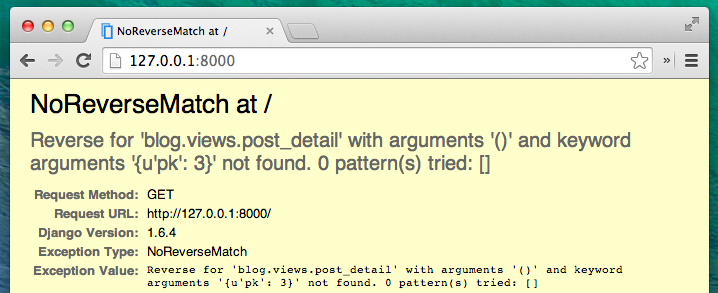

 # Extend your application

もう、ウェブサイトを作るのに必要な全ての章は終わりました。どのようにモデル、URL、ビュー、テンプレートを書いたら良いかわかっていますし、またウェブサイトの作り方もわかります。

さあ練習しましょう！

ブログに最初に必要なものはおそらく、記事を表示するページですよね。

もう`Post`モデルが入っていますから、`models.py`は追加する必要はありません。

## Create a link in the template

`blog/templates/blog/post_list.html`ファイルに次のようにリンクを追加しましょう：

    

    
        
            

                

                    {{ post.published_date }}
                

                <h1><a href="">{{ post.title }}</a></h1>
                
{{ post.text|linebreaks }}

            

        
    

投稿のタイトルから詳細記事へリンクさせたい時は、`<h1><a href="">{{ post.title }}</a></h1>`の箇所をリンク先に変えてみましょう。

    <h1><a href="">{{ post.title }}</a></h1>

``という不思議なものについて説明しましょう。うすうすわかっているかもしれませんが、``という表記はDjangoのテンプレートタグを使っているということを意味します。今回書いたこれは、URLに変換されます。

`post_detail`は`post_detail`ビューへのパスです。注：blogはアプリケーションの名前です。ビューは`views.py`ファイルの名前で`post_detail`はビューの名前です。

http://127.0.0.1:8000/ にアクセスすると、エラーとなりますが、これは想定通り。URLや`post_detail`のビューをまだ作ってないからです。このようになります：

なので、`urls.py`に`post_detail`ビューを作りましょう。

### URL: http://127.0.0.1:8000/post/1/

Djangoに`post_detail`が呼び出すビューを作りましょう。このビューでブログの投稿を表示します。 `blog/urls.py` ファイルに`url(r'^post/(?P<pk>[0-9]+)/$', views.post_detail),`を追加して下さい:

    from django.conf.urls import include, url
    from . import views

    urlpatterns = [
        url(r'^$', views.post_list),
        url(r'^post/(?P<pk>[0-9]+)/$', views.post_detail, name='post_detail'),
    ]

何だか変に見えますが、心配しないで下さい、説明しますと、

- `^`で始まるのは「文字列の開始」です。

- `post/` はURLに__post__と__/__を含む

- `(?P<pk>[0-9]+)` これはトリッキーな部分です。Djangoはここに書いた全てを受けてそれを`pk`という変数としてビューへ渡します。`[0-9]`は（0から9の間の)数字のみを意味し、`+`はそれが一桁以上続くことを意味しています。`http://127.0.0.1:8000/post//` はダメで`http://127.0.0.1:8000/post/1234567890/` はOKです。

- `/` - もう一度__/__が必要です。

- `$`は「文字列の終了」を意味します。

ブラウザで`http://127.0.0.1:8000/post/5/`を表示した時、Djangoはビューが`post_detail`を呼び出すということを理解します。そして、`pk`の部分は5とビューへ渡します。

`pk`とはprimary keyの省略です。
この名前はDjangoプロジェクトでよく使われますが、好きに名前を付けることもできます（でも、英小文字と`_`だけで、空白などは入れないように！）。`(?P<pk>[0-9]+)` の代わりに、`post_id`と名付けるとすれば`(?P<post_id>[0-9]+)` となります。

OK,ページ http://127.0.0.1:8000 をリロードしてみましょう。けどまた違うエラーが出てきました！

次のステップを思い出しました？そうです、ビューの追加です。

## post_detail view

ここでは、ビューが特別なパラメータ`pk`に渡され、ビューはそれを受け取る必要があります。URLで決めた名前 (`pk`) を正確に使う必要があります。`def post_detail(request, pk):`と関数を定義しましょう。この変数を省いてしまうとエラーになります。

`pk`で指定されたブログの記事を取得するにはクエリセットを使います:

    Post.objects.get(pk=pk)

しかしこのコードには問題があります。指定された`pk`を持つブログ記事がないと、なんだかとてもダサいエラーが出てきます。

表示してほしいのはこれじゃないです。でももちろん、Django にはこれをうまく処理してくれるものがあります。それが `get_object_or_404` です。`pk`のブログ記事がないときは「404、ページがありません」とさっきよりずいぶんマシな表示をしてくれるのです。

実際に「ページがありません」というページを作れますし、したいようにできますが、重要でないので、飛ばしましょう。

OK,ビューを`views.py`ファイルに追加しましょう。

`blog/views.py`ファイルを開いて、今ある`from`で始まる行の次の行に、このコードを追加しましょう:

    from django.shortcuts import render, get_object_or_404

そして、ファイルの最後にビューを追加します。

    def post_detail(request, pk):
        post = get_object_or_404(Post, pk=pk)
        return render(request, 'blog/post_detail.html', {'post': post})

それでは、もう一度 http://127.0.0.1:8000/ をリロードしてみましょう。

動きました！しかしブログ記事のタイトルのリンクをクリックしたらどうなりますか？

そんな！別のエラーです。しかしこの対処方法を知っていますよね。テンプレートを追加しましょう。

`blog/templates/blog`に`post_detail.html`を作りましょう。

このように書きましょう:

    

    
        

            
                

                    {{ post.published_date }}
                

            
            <h1>{{ post.title }}</h1>
            
{{ post.text|linebreaks }}

        

    

前と同じで`base.html`を拡張します。`content`のブロックで、もしあれば記事の投稿日(`publish_date`)、タイトル(`title`)と本文(`text`)を表示します。ここで重要なポイントについて見てみます。

` ... `は何かをチェックするときに使うテンプレートタグです。（__Introduction to Python__ の章にあるif~else文を思い出して下さい）この場合は`published_date`が空欄かどうかを確認しています。

OK,ページをリロードして、もう「ページがありません」とは言われなくなっているか見てみましょう。

やった！動きました！

## One more thing: deploy time!

もしウェブサイトがHerokuで動いているなら、確認するのは良いことです。もう一度deployしてみましょう。どのようにやるか忘れていたら、[Deploy](../deploy/README.md) の章を確認しましょう。

    $ git status
    ...
    $ git add -A .
    $ git status
    ...
    $ git commit -m "Added more views to the website."
    ...
    $ git push heroku master

できました！おめでとう:)
