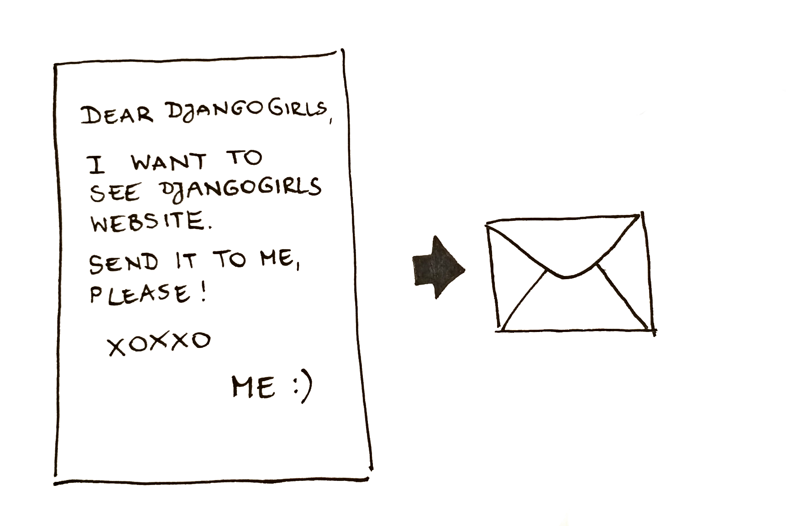

# インターネットはどうやって動いているの？

> This chapter is inspired by a talk "How the Internet works" by Jessica McKellar \([http://web.mit.edu/jesstess/www/](http://web.mit.edu/jesstess/www/)\).

私達は毎日インターネットにつながっていますよね。でも、あなたがブラウザのアドレス欄に　[http://djangogirls.org](http://djangogirls.org)　のように入力をしてEnterキーを押している事がどういう意味がるのかわかりますか？

最初に理解してほしいのは、あなたが自分のパソコンのハードディスクに映画や音楽や写真を沢山保存しているように、Webサイトもハードディスクに保存される沢山のファイルの集合であるという事です。

しかし、Webサイトは映画や音楽、写真のようなデータとは違ってHTMLというコンピュータのコードを持っているのです。もし、あなたがプログラミングに精通していなかったら、最初はHTMLも難しく感じるでしょう。でも、あなたがよく使うWebブラウザ（ChromeやSafariやFirefox等々）はHTMLのコードを理解しているのです。Webブラウザが正しく理解できるように、ファイルを作成する必要があります。

あなたのパソコンへファイルを保存するのと同じで私達はHTMLをハードディスクに格納する必要があります。インターネットの場合、そのハードディスクはサーバーと呼ばれている、パワフルなコンピュータを使います。サーバーの主な目的はデータを格納して、それに供給することであるので、マウスまたはキーボードを持っていません。また、データを供給する役割を持っているので、サーバーと呼ばれるのです。

インターネットはどのように見えますか？

私達は絵をかいてみました。

上記の絵は混乱しているように見えますよね？接続されたマシンのネットワークは実際こんな感じです。数十万台のマシン！ 世界中はりめぐらされたケーブル！ Submarine Cable Mapのウェブサイト（[http://submarinecablemap.com/](http://submarinecablemap.com/)）にアクセスすれば、ネットの複雑さを知ることができます。 ここにウェブサイトからのスクリーンショットがあります：

インターネットに接続されているすべてのマシンとマシンの間にワイヤを置くことは不可能です。 したがって、マシン（例えば　[http://djangogirls.org](http://djangogirls.org)　が保存されているマシン）に到達するためには、多くの異なるマシンを介してリクエストを渡す必要があります。

それは次のようになります。

あなたが [http://djangogirls.org ](http://djangogirls.org)と入力すると、「親愛ならDjango Girlsへ。私はdjangogirls.orgのWebサイトが見たいです」とリクエスト（手紙）を送る事になります。

あなたの手紙（リクエスト）は、まずあなたの一番近くの郵便局にいきますよね。そしてそこから、もう少し宛先に少し近い別の郵便局に行き、またそこからもう少し近い郵便局に行って・・そしてあなたの目的地まで行きます。

簡単ですよね。あなたはメッセージを送信し、何らかの応答を期待します。 もちろん、紙とペンではなく、データのバイトを使用しますが、アイデアは同じです！

市町村名、郵便番号、国名の住所の代わりに、IPアドレスを使用します。 お使いのコンピュータは、まずdjangogirls.orgをIPアドレスに変換するようにDNS（Domain Name System）に依頼します。 あなたが連絡したい人の名前を探し、電話番号と住所を見つけることができる昔ながらの電話帳のようなものです。

手紙を送るときには、住所、切手など、正しく配送される特定の機能が必要ですよね。また、受信者が理解できる言語も使用している必要がありますよね？ Webサイトを表示するために送信するデータパケットにも同じように特定の機能があります。それはHTTP（Hypertext Transfer Protocol）というプロトコルを使用します。

だから、基本的に、あなたがウェブサイトを持っているときには、サーバー（マシン）が必要です。 サーバーは着信要求（サーバーにWebサイトの送信を要求する文字）を待機し、返事を返します。

これはDjangoチュートリアルなので、あなたはDjangoが何をしているのかを知りたでしょう？ あなたが返事を返す時、 みんなに同じ返事を返すより、個々にパーソナライズされた返事を返せた方が良いでしょう？（Djangoはこれらのパーソナライズされた興味深い文字を作成するのに役立ちます:\)。

インターネットの話は以上です！さあ、いよいよあなたのブログサイトを作成する時間です！

