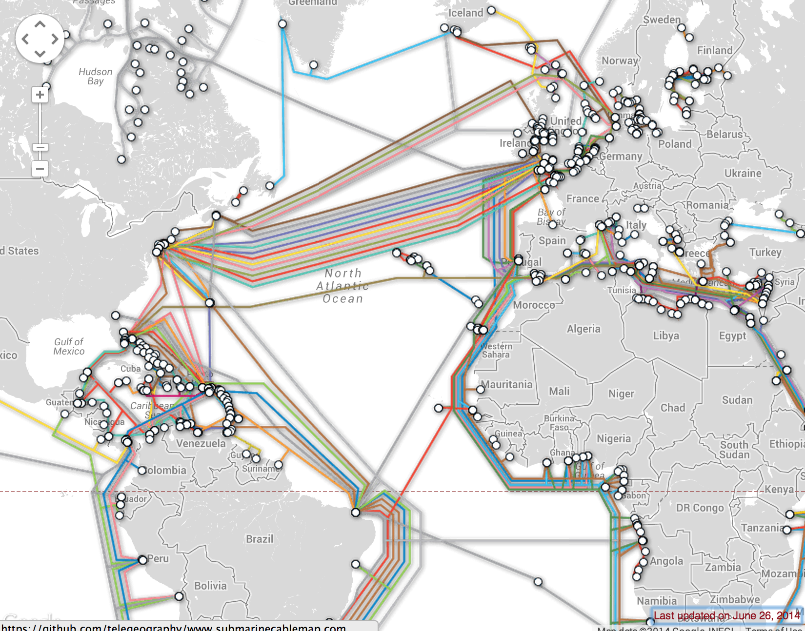

# How the Internet works

> この章は、Jessica McKellar の"How the Internet works"(http://web.mit.edu/jesstess/www/) にインスパイアされて書いています。

貴女もインターネットを毎日使っているでしょう。でもhttp://djangogirls.orgみたいに、アドレスを打ってエンターキーを押したとき、その先で何が起こっていると思いますか？

最初に知っておくべきことは、ウェブサイトって実は、ハードディスクに保存されたただのファイルだっていうこと。動画や音楽、写真と同じです。
一つ違うことがあるとすれば、それはHTMLと呼ばれるプログラムが書かれていること。

プログラミングについてあまり詳しくないと、HTMLに馴染みがないかも知れないけど、ChromeやSafariやFirefoxといったブラウザが読んでくれるから大丈夫。
If you're not familiar with programming, it can be hard to grasp HTML at first, but your web browsers (like Chrome, Safari, Firefox, etc.) love it. Web browsers are designed to understand this code,
follow its instructions and present all these files that your website is made of exactly the way you want them to be presented.

どのファイルもそうですが、HTMLファイルもハードディスクに保存しなくてはなりません。インターネットではその役目はパワフルな*サーバ*と呼ばれるコンピュータに任されます。サーバは
保存したデータを配信するのが主な役割なので、ディスプレイもマウスもキーボードもありません。配信（サーブ）するためのコンピュータだから、*サーバ*と呼ばれるというわけです。

インターネットがどんな「見た目」か、知りたくなってきたでしょう？

We drew you a picture! It looks like this:

Looks like a mess, right? In fact it is a network of connected machines (the above mentioned *servers*). Hundreds of thousands of machines! Many, many kilometers of cables around the world! You can visit a Submarine Cable Map website (http://submarinecablemap.com/) to see how complicated the net is. Here is a screenshot from the website:

It is fascinating, isn't it? But obviously, it is not possible to have a wire between every machine connected to the Internet. So, to reach a machine (for example the one where http://djangogirls.org is saved) we need to pass a request through many, many different machines.

It looks like this:

Imagine that when you type http://djangogirls.org, you send a letter that says: "Dear Django Girls, I want to see the djangogirls.org website. Send it to me, please!"

Your letter goes to the post office closest to you. Then it goes to another that is a bit nearer to your addressee, then to another and another till it is delivered at its destination. The only unique thing is that if you send letters (*data packets*) frequently to the same place, each letter might go through totally different post offices (*routers*), depending on how they are distributed in each office.

Yes, it is as simple as that. You send messages and you expect some response. Of course, instead of paper and pen you use bytes of data, but the idea is the same!

Instead of addresses with a street name, city, zip code and country name, we use IP addresses. Your computer first asks the DNS (Domain Name System) to translate djangogirls.org into an IP address. It works a little bit like old-fashioned phonebooks where you could look for the name of the person you want to contact and find their phone number and address.

When you send a letter, it needs to have certain features to be delivered correctly: an address, stamp etc. You also use a language that the receiver understands, right? The same is with *data packets* you send in order to see a website: you use a protocol called HTTP (Hypertext Transfer Protocol).

So, basically, when you have a website you need to have a *server* (machine) where it lives. The *server* is waiting for any incoming *requests* (letters that ask the server to send your website) and it sends back your website (in another letter).

Since this is a Django tutorial, you will ask what Django does. When you send a response, you don't always want to send the same thing to everybody. It is so much better if your letters are personalized, especially for the person that has just written to you, right? Django helps you with creating these personalized, interesting letters :).

Enough talk, time to create!
