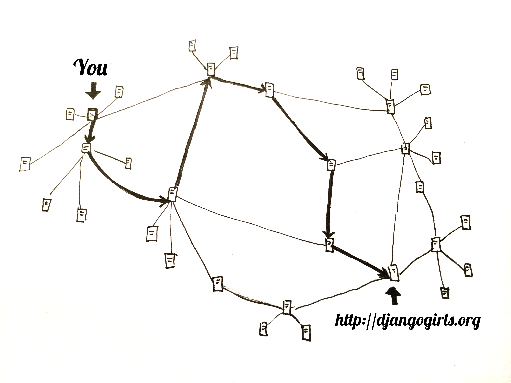

# インターネットはどうやって動いているの？

> This chapter is inspired by a talk "How the Internet works" by Jessica McKellar \([http://web.mit.edu/jesstess/www/](http://web.mit.edu/jesstess/www/)\).

私達は毎日インターネットにつながっていますよね。でも、あなたがブラウザのアドレス欄に　[http://djangogirls.org](http://djangogirls.org)　のように入力をしてEnterキーを押している事がどういう意味がるのかわかりますか？

最初に理解してほしいのは、あなたが自分のパソコンのハードディスクに映画や音楽や写真を沢山保存しているように、Webサイトもハードディスクに保存される沢山のファイルの集合であるという事です。

しかし、Webサイトは映画や音楽、写真のようなデータとは違ってHTMLというコンピュータのコードを持っているのです。もし、あなたがプログラミングに精通していなかったら、最初はHTMLも難しく感じるでしょう。でも、あなたがよく使うWebブラウザ（ChromeやSafariやFirefox等々）はHTMLのコードを理解しているのです。Webブラウザが正しく理解できるように、ファイルを作成する必要があります。

あなたのパソコンへファイルを保存するのと同じで私達はHTMLをハードディスクに格納する必要があります。インターネットの場合、そのハードディスクはサーバーと呼ばれている、パワフルなコンピュータを使います。サーバーの主な目的はデータを格納して、それに供給することであるので、マウスまたはキーボードを持っていません。また、データを供給する役割を持っているので、サーバーと呼ばれるのです。

インターネットはどのように見えますか？

私達は絵をかいてみました。

上記の絵は混乱しているように見えますよね？接続されたマシンのネットワークは実際こんな感じです。数十万台のマシン！ 世界中はりめぐらされたケーブル！ Submarine Cable Mapのウェブサイト（[http://submarinecablemap.com/](http://submarinecablemap.com/)）にアクセスすれば、ネットの複雑さを知ることができます。 ここにウェブサイトからのスクリーンショットがあります：

インターネットに接続されているすべてのマシンとマシンの間にワイヤを置くことは不可能です。 したがって、マシン（例えば　[http://djangogirls.org](http://djangogirls.org)　が保存されているマシン）に到達するためには、多くの異なるマシンを介してリクエストを渡す必要があります。

それは次のようになります。

あなたが [http://djangogirls.org ](http://djangogirls.org)と入力すると、「親愛ならDjango Girlsへ。私はdjangogirls.orgのWebサイトが見たいです」とリクエスト（手紙）を送る事になります。

あなたの手紙（リクエスト）は、まずあなたの一番近くの郵便局にいきますよね。そしてそこから、もう少し宛先に少し近い別の郵便局に行き、またそこからもう少し近い郵便局に行って・・そしてあなたの目的地まで行きます。

Yes, it is as simple as that. You send messages and you expect some response. Of course, instead of paper and pen you use bytes of data, but the idea is the same!

Instead of addresses with a street name, city, zip code and country name, we use IP addresses. Your computer first asks the DNS \(Domain Name System\) to translate djangogirls.org into an IP address. It works a little bit like old-fashioned phonebooks where you could look for the name of the person you want to contact and find their phone number and address.

When you send a letter, it needs to have certain features to be delivered correctly: an address, stamp etc. You also use a language that the receiver understands, right? The same is with _data packets_ you send in order to see a website: you use a protocol called HTTP \(Hypertext Transfer Protocol\).

So, basically, when you have a website you need to have a _server_ \(machine\) where it lives. The _server_ is waiting for any incoming _requests_ \(letters that ask the server to send your website\) and it sends back your website \(in another letter\).

Since this is a Django tutorial, you will ask what Django does. When you send a response, you don't always want to send the same thing to everybody. It is so much better if your letters are personalized, especially for the person that has just written to you, right? Django helps you with creating these personalized, interesting letters :\).

Enough talk, time to create!

