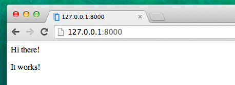

# Introduction to HTML

テンプレートって何？とあなたは思っているかもしれませんね。

テンプレートは、あらかじめ用意された共通したフォーマットのなかで異なる情報をみせるためのファイルです。 - 例えば、手紙を書く時に、中身は異なるメッセージや宛名や住所を書きますが、共通のフォーマットを使いますよね。それがテンプレートです。

Djangoのテンプレートは、HTMLという言語でできています。 (はじめのチャプター__How the Internet works__で、HTMLについては少しお話しましたね。）

## What is HTML?

HTML is a simple code that is interpreted by your web browser - such as Chrome, Firefox or Safari - to display a webpage for the user.

HTML stands for "HyperText Markup Language". __HyperText__ means it's a type of text that supports hyperlinks between pages. __Markup__ means we have taken a document and marked it up with code to tell something (in this case, a browser) how to interpret the page. HTML code is built with __tags__, each one starting with `<` and ending with `>`. These tags markup __elements__.

## Your first template!

テンプレートを作成するということは、テンプレートファイルを作成するという意味です。すべてはファイルですよね？あなたは、このことにすでに気がついていることと思います。

テンプレートは次のディレクトリに保存します。`blog/templates/blog`  では、まずblogディレクトリに `templates`　という新しいディレクトリを作成しましょう。次に、templatesディレクトリの中に、`blog`というディレクトリを作成します。:

    blog
    └───templates
        └───blog

(なぜ`blog`という名前のディレクトリが２つもあるのだろうと、疑問に思ったかもしれませんね。 - 後にわかってくると思いますが、これは複雑になりやすい物事を楽にするための、わかりやすい命名規則なのです。)

さて、`blog/templates/blog`ディレクトリの中に、 `post_list.html` というファイルを作成しましょう。 (今のところは、空っぽのファイルにしておいてください。) 

ここで、あなたのWebサイトがどのように見えるか確認してみましょう。: http://127.0.0.1:8000/

> もし、まだ`TemplateDoesNotExists`というエラーが出るようでしたら、サーバーをリスタートしてみてください。コマンドラインで、Ctrl+C (Control と C ボタンを同時に押す)を押すと、サーバーが止まります。`python manage.py runserver` とコマンドを打って、再度スタートしてください。

エラーが出なくなりました！おめでとう！！:) しかし、あなたのWebサイトはまだ何も表示されていませんね。あなたのテンプレートにまだ何もないからです。これを修正していきましょう。

テンプレートファイルに、次のとおりにコードを追加して下さい。:

    <html>
        
Hi there!

        
It works!

    </html>

さて、あなたのWebサイトは今度はどのように見えるでしょうか？確認してみましょう。: http://127.0.0.1:8000/

表示されましたね！よくできました！ :)

- `<html>`、Webページのはじまりにつけるタグです。そして`</html>` はページの最後につきます。先ほどの例でお分かりのように、最初の行の`<html>`と、 最終行の `</html>` の間に、Webサイトの全てのコンテンツが書かれています。
- `
` はパラグラフのタグです。 `
` を各パラグラフの終わりにつけます。

## Head & body

すべてのHTMLページは、２つの要素が必要です。: __head__ と __body__　です。

- __head要素__ 　これには、ドキュメントに必要な情報を含んでいます。ディスプレイには表示されません。

- __body要素__ 　これには、そのほかのWebページに表示される内容が含まれます。

`<head>` は、ページの構成などをブラウザに伝えます。そして、`<body>` のタグ内の内容が、実際にページに表示されます。W

例えば、次の例のように、Webページのタイトル `<head>`　タグの中に含めることができます。:

    <html>
        <head>
            <title>Ola's blog</title>
        </head>
        <body>
            
Hi there!

            
It works!

        </body>
    </html>

ファイルを保存して、再読み込みしてみましょう。

あなたのページのタイトルが"Ola's blog"だと、ブラウザが認識してくれましたね？　<head>タグ内に書かれた `<title>Ola's blog</title>` をブラウザは解釈して、ブラウザのタイトルバーの文字が反映されました。(ブックマークのタイトルなどにも使われます).

おそらく既にお気づきでしょう。タグは開始タグと終了タグのペアになっていて、終了タグには`/`がつきます。そして要素の中にほかの要素が次々と入れ子になっています。 (i.e. you can't close a particular tag until all the ones that were inside it have been closed too).

これば箱にものを入れるようなイメージです。まず最初に、`<html></html>`という大きな箱を１つもっています。その中に、`<body></body>`という箱があり、また更にその中に`

`という小さい箱が入っています。

タグを閉じることと、入れ子にすることは、守らなければいけないルールです。タグを閉じていなかったり、入れ子になっていないと、ブラウザは正しく解釈ができないため、あなたのページは正しく表示されません。

## Customize your template

テンプレートをつかって、カスタマイズしてちょっと遊んでみてください。よく使われるタグをいくつかご紹介しておきますね。:

- `<h1>見出し１</h1>` - 一番大きな見出し
- `<h2>見出し２</h2>` 次に大きな見出し
- `<h3>見出し３</h3>` ... 見出しのレベルは１〜６まであり、`<h6>`が一番小さい見出しとなります。
- `<em>text</em>` 要素に囲まれたテキストを強調します。文章の意味合いとして強調すべき語句やフレーズを示します。
- `<strong>text</strong>` 囲まれたテキストを強く強調します。文中の特定の語句が重要であることを示します。
- ` ` br は BReak(改行)の略です。テキストをこの位置で改行します。(brの中には、何も書いてはいけません)
- `<a href="http://djangogirls.org">link</a>` リンクをつくります。
- `<ul><li>first item</li><li>second item</li></ul>` リストをつくります。
- `

` ブロック要素として囲みます。

以下をテンプレートとして使って下さい。:

    <html>
        <head>
            <title>Django Girls blog</title>
        </head>
        <body>
            

                <h1><a href="">Django Girls Blog</a></h1>
            

            

                
published: 14.06.2014, 12:14

                <h2><a href="">My first post</a></h2>
                
Aenean eu leo quam. Pellentesque ornare sem lacinia quam venenatis vestibulum. Donec id elit non mi porta gravida at eget metus. Fusce dapibus, tellus ac cursus commodo, tortor mauris condimentum nibh, ut fermentum massa justo sit amet risus.

            

            

                
published: 14.06.2014, 12:14

                <h2><a href="">My second post</a></h2>
                
Aenean eu leo quam. Pellentesque ornare sem lacinia quam venenatis vestibulum. Donec id elit non mi porta gravida at eget metus. Fusce dapibus, tellus ac cursus commodo, tortor mauris condimentum nibh, ut f.

            

        </body>
    </html>

ここで、３つの `div` ブロックを作りました。

- 最初の `div` 要素は、ブログのタイトルです。見出しとリンクが含まれていますね。 - it's a heading and a link
- その他の２つの `div` 要素は、ブログ記事を投稿日時とを囲んでいます。 `h2` の見出しは、リンクタグがついた記事のタイトルです。そして、２つの`p`　パラグラフがありますね。投稿日時とブログ記事の内容です。

ブラウザで見るとこのようになります。:

Yaaay! うまく表示されましたね！でも、まだこのテンプレートは__同じ情報__を表示するだけですね。 - 先ほどお話したようにテンプレートとは、__同じフォーマット__で、__異なる__情報を表示するものです。　whereas earlier we were talking about templates as allowing us to display __different__ information in the __same format__.

私たちが本来やりたいことというのは、Djangoのアドミニに追加された記事の情報を、同じフォーマットで表示することです。 - では、次のレベルにいってみましょう。

## One more thing

It'd be good to see if your website will be still working on Heroku, right? Let's try deploying again.

First off, let's see what files have changed since we last deployed:

    $ git status

Let's tell `git` to include all the changes from the current directory:

    $ git add -A .

> __Note__ `-A` (short for "all") means that `git` will also recognize if you've deleted files (by default, it only recognizes new/modified files). Also remember (from chapter 3) that `.` means the current directory.

Before we upload all the files, let's check what `git` will be uploading (all the files that `git` will upload should now appear in green):

    $ git status

We're almost there, now it's time to tell it to save this change in its history. We're going to give it a "commit message" where we describe what we've changed. You can type anything you'd like at this stage, but it's helpful to type something descriptive so that you can remember what you've done in the future.

    $ git commit -m "Changed the HTML for the site."

> __Note__ Make sure you use double quotes around the commit message.

Once we've done that, we can finally upload (push) our changes to the website on heroku:

    git push heroku master

And that should be it! Once Heroku is finished, you can go ahead and refresh your website in the browser. Changes should be visible!
