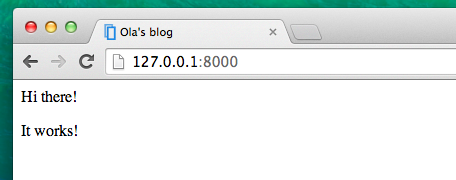
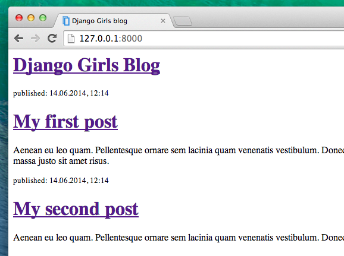

# Introduction to HTML

テンプレートって何？とあなたは思っているかもしれませんね。

テンプレートは、あらかじめ用意された共通したフォーマットのなかで異なる情報をみせるためのファイルです。 - 例えば、手紙を書く時に、中身は異なるメッセージや宛名や住所を書きますが、共通のフォーマットを使いますよね。それがテンプレートです。

Djangoのテンプレートは、HTMLという言語でできています。 (はじめのチャプター__How the Internet works__で、HTMLについては少しお話しましたね。）

## What is HTML?

HTMLはシンプルなプログラムで、ChromeやFireFox、SafariといったWebブラウザが解釈して、ユーザーが読めるようにしてディスプレイに表示します。

HTML は "HyperText Markup Language"の略です。 __HyperText__とは、テキストなどをクリックすると別のページに繋がるハイパーリンクが使えるということです。__Markup__は、目印をつけるという意味です。文章の各部分がどのような役割を果たしているかブラウザに伝えます。`<`と `>`に囲まれた__タグ__によってマークアップされたものは、要素と呼ばれます。

## Your first template!

テンプレートを作成するということは、テンプレートファイルを作成するという意味です。すべてはファイルですよね？あなたは、このことにすでに気がついていることと思います。

テンプレートは `blog/templates/blog` ディレクトリに保存します。では、まず`blog`ディレクトリに `templates` という新しいディレクトリを作成しましょう。次に、`templates`ディレクトリの中に、`blog`というディレクトリを作成します。:

    blog
    └───templates
        └───blog

(なぜ`blog`という名前のディレクトリが２つもあるのだろうと、疑問に思ったかもしれませんね。 - 後にわかってくると思いますが、これは複雑になりやすい物事を楽にするための、わかりやすい命名規則なのです。)

さて、`blog/templates/blog`ディレクトリの中に、 `post_list.html` というファイルを作成しましょう。 (今のところは、空っぽのファイルにしておいてください。)

ここで、あなたのWebサイトがどのように見えるか確認してみましょう。: http://127.0.0.1:8000/

> もし、まだ`TemplateDoesNotExists`というエラーが出るようでしたら、サーバーをリスタートしてみてください。コマンドラインで、Ctrl+C (Control と C ボタンを同時に押す)を押すと、サーバーが止まります。`python manage.py runserver` とコマンドを打って、再度スタートしてください。

エラーが出なくなりました！おめでとう！！:) しかし、あなたのWebサイトはまだ何も表示されていませんね。あなたのテンプレートにまだ何もないからです。これを修正していきましょう。

テンプレートファイルに、次のとおりにコードを追加して下さい。:

    <html>
        
Hi there!

        
It works!

    </html>

さて、あなたのWebサイトは今度はどのように見えるでしょうか？確認してみましょう。: http://127.0.0.1:8000/

表示されましたね！よくできました！ :)

- `<html>`、Webページのはじまりにつけるタグです。そして`</html>` はページの最後につきます。先ほどの例でお分かりのように、最初の行の`<html>`と、 最終行の `</html>` の間に、Webサイトの全てのコンテンツが書かれています。
- `
` はパラグラフのタグです。 `
` を各パラグラフの終わりにつけます。

## Head & body

すべてのHTMLページは、２つの要素が必要です。: __head__ と __body__ です。

- __head要素__ これには、ドキュメントに必要な情報を含んでいます。ディスプレイには表示されません。

- __body要素__ これには、そのほかのWebページに表示される内容が含まれます。

`<head>` は、ページの構成などをブラウザに伝えます。そして、`<body>` のタグ内の内容が、実際にページに表示されます。

例えば、次の例のように、Webページのタイトルを `<head>` タグの中に含めることができます。:

    <html>
        <head>
            <title>Ola's blog</title>
        </head>
        <body>
            
Hi there!

            
It works!

        </body>
    </html>

ファイルを保存して、再読み込みしてみましょう。

あなたのページのタイトルが"Ola's blog"だと、ブラウザが認識してくれましたね？ <head>タグ内に書かれた `<title>Ola's blog</title>` をブラウザは解釈して、ブラウザのタイトルバーの文字が反映されました。(ブックマークのタイトルなどにも使われます).

おそらく既にお気づきでしょう。タグは開始タグと終了タグのペアになっていて、終了タグには`/`がつきます。そして要素の中にほかの要素が次々と入れ子になっています (入れ子なので、あるタグを閉じるときには、その中のタグもすべて閉じていなくてはなりません)。

これは箱にものを入れるようなイメージです。まず最初に、`<html></html>`という大きな箱を１つもっています。その中に、`<body></body>`という箱があり、また更にその中に`

`という小さい箱が入っています。

タグを閉じることと、入れ子にすることは、守らなければいけないルールです。タグを閉じていなかったり、入れ子になっていないと、ブラウザは正しく解釈ができないため、あなたのページは正しく表示されません。

## Customize your template

テンプレートをつかって、カスタマイズしてちょっと遊んでみてください。よく使われるタグをいくつかご紹介しておきますね。:

- `<h1>見出し１</h1>` - 一番大きな見出し
- `<h2>見出し２</h2>` 次に大きな見出し
- `<h3>見出し３</h3>` ... 見出しのレベルは１〜６まであり、`<h6>`が一番小さい見出しとなります。
- `<em>text</em>` 要素に囲まれたテキストを強調します。文章の意味合いとして強調すべき語句やフレーズを示します。
- `<strong>text</strong>` 囲まれたテキストを強く強調します。文中の特定の語句が重要であることを示します。
- ` ` br は BReak(改行)の略です。テキストをこの位置で改行します。(brの中には、何も書いてはいけません)
- `<a href="http://djangogirls.org">link</a>` リンクをつくります。
- `<ul><li>first item</li><li>second item</li></ul>` リストをつくります。
- `

` ブロック要素として囲みます。

以下をテンプレートとして使って下さい。:

    <html>
        <head>
            <title>Django Girls blog</title>
        </head>
        <body>
            

                <h1><a href="">Django Girls Blog</a></h1>
            

            

                
published: 14.06.2014, 12:14

                <h2><a href="">My first post</a></h2>
                
Aenean eu leo quam. Pellentesque ornare sem lacinia quam venenatis vestibulum. Donec id elit non mi porta gravida at eget metus. Fusce dapibus, tellus ac cursus commodo, tortor mauris condimentum nibh, ut fermentum massa justo sit amet risus.

            

            

                
published: 14.06.2014, 12:14

                <h2><a href="">My second post</a></h2>
                
Aenean eu leo quam. Pellentesque ornare sem lacinia quam venenatis vestibulum. Donec id elit non mi porta gravida at eget metus. Fusce dapibus, tellus ac cursus commodo, tortor mauris condimentum nibh, ut f.

            

        </body>
    </html>

ここで、３つの `div` ブロックを作りました。

- 最初の `div` 要素は、ブログのタイトルです。見出しとリンクが含まれていますね。
- その他の２つの `div` 要素は、ブログ記事を投稿日時とを囲んでいます。 `h2` の見出しは、リンクタグがついた記事のタイトルです。そして、２つの`p`パラグラフがありますね。投稿日時とブログ記事の内容です。

ブラウザで見るとこのようになります。:

わーい！うまく表示されましたね！でも、まだこのテンプレートは__同じ情報__を表示するだけですね。 - 先ほどお話したようにテンプレートとは、__同じフォーマット__で、__異なる__情報を表示するものです。

私たちが本来やりたいことというのは、Djangoの管理画面に追加された記事の情報を、同じフォーマットで表示することです。では、次のレベルにいってみましょう。

## One more thing

このWebサイトがローカルだけでなく、同じようにHerokuでも動いているのを見たいですね。再度デプロイしてみましょう。

まずは、先ほどのデプロイから、どのファイルが更新されたか状態を確認しましょう。:

    $ git status

次に、作業ディレクトリ内のすべての変更を`git` に追加します。:

    $ git add -A .

> __補足__ `-A` ("all"の意味) とすると、削除されたファイルも`git`は認識します。（デフォルトでは、新規ファイルと変更のあったファイルだけを認識します）そして、チャプター3で説明があったように、 `.` は、カレントディレクトリを示していますので、忘れないようにしましょう。

すべてのファイルをアップロードする前に、 `git` が何をアップロードしようとしているのか、確認しておきましょう。（ `git`がアップロードしようとしている全てのファイルが緑色で表示されます）:

    $ git status

あとちょっとです！がんばりましょう。gitに変更を保存しておきましょう。どのような変更を加えたかわかるように、"コミットメッセージ"をつけておきます。メッセージはなんでも構いませんが、後でなにをしたかわかるような説明をしておくとよいでしょう。

    $ git commit -m "Changed the HTML for the site."

> __補足__ コミットメッセージは、ダブルクォーテーションで囲みましょう。

この次に、やっと変更をHerokuのWebサイトにアップロード（プッシュ）することができます。:

    git push heroku master

アップロードの作業は以上です。Herokuでの処理がおわれば、ブラウザ上で変更を加えられたサイトが見れるでしょう。ブラウザを再読み込みして確認してください。変更されていますね！
